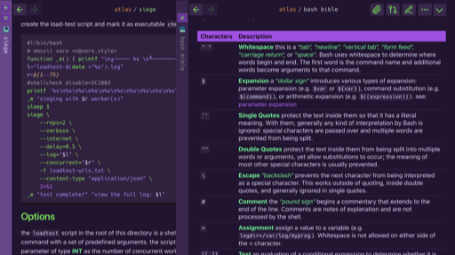

# evangelion obsidian



a theme for [obsidian](https://obsidian.md) inspired by neon genesis evangelion.

> **note:** i built this theme for the ipad version of the app.
> it's tested it on desktop and mobile, but is a tablet 1st theme.

##  previews

### markdown

### omni search

### outlines

### code blocks

### frontmatter

### footnotes

### splits

### srcview

### settings

### tables

### diff

### ascii art

### new tab


# css snippets

this repo also contains my [snippets library](https://github.com/xero/evangelion.obsidian/tree/snippets) in the `snippets` branch. mostly fonts and ui related tweaks for ascii art

# contributing

pr's are welcomed! especially for mobile fixes

```
   N E O N       _            ____
                : \           |   \    .
 G E N E S i S  |  \ .        |    :   |\            /\
             .  |   :|\__     |    |   | \          /  \
.            |\ |   |! \ \    |    |   | |\        /   /
\"-.______   | \:   ||\ \ \   |    |   | | \      /   /
 \_       "-_|  |\  || \ \/   |    |___| ! |\____/  _/-. /\
   "-_   ____:  |_\ ||  \/  ___\  __  _//  | |  ___ \---" /
      \  \   |  _____,  /___\___\/ / /   \_! |  // _/  / /
    ___\_ \__|  |    | __. _/____ / /     /  > // /    \/
  //_________|  /    |/  |/  \__// /     /  /_/ \/
             | /     |   :      | /     /__/
             |/                 |/   E V A N G E L I O N
```

# todo

## submit to the theme gallery

waiting for approval on [pr #4302](https://github.com/obsidianmd/obsidian-releases/pull/4304) to [`obsidian-releases`](https://github.com/obsidianmd/obsidian-releases#community-theme)

# license


all files and scripts in this repo are released [CC0](https://creativecommons.org/publicdomain/zero/1.0/) / [kopimi](https://kopimi.com)! in the spirit of _freedom of information_, i encourage you to fork, modify, change, share, or do whatever you like with this project! `^c^v`
